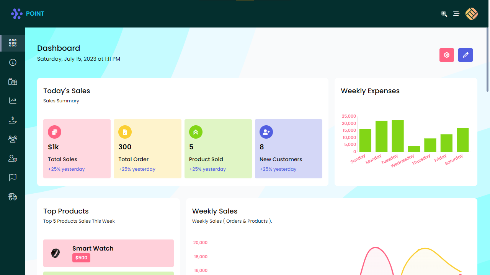
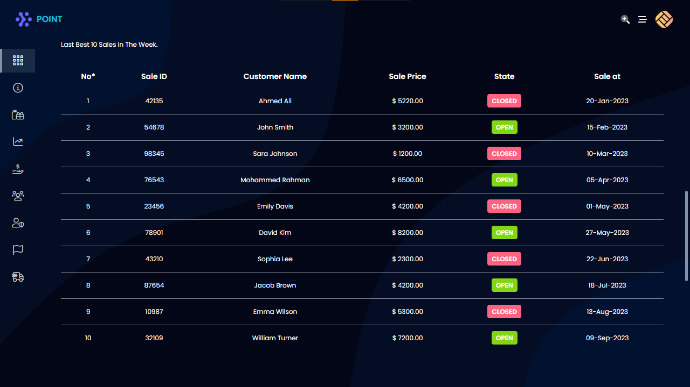

# Product Management System

a Dashboard Template for Product Management System 

 

## # Requirements
* Install `Nodejs` <= v20.2.0

## # How to run ?
* **Start App** `$ npm start`
* **Testing With Typescript** `$ npm test:ts`
* **Build App** `$ npm run build`

## # Importing Allies
* `@/*` root directory is (`./src`)
* `~/*` root directory is (`./public`)
* `~bootstrap/*` root directory is (`./node_modules/bootstrap/scss`)

## # Libraries & Languages
* ### You will find the libraries version in `package.json`
* [SASS](https://sass-lang.com/) 
* [TypeScript](https://www.typescriptlang.org) 
* [Bootstrap](https://getbootstrap.com) 
* [react-bootstrap](react-bootstrap.github.io) 
* [Tailwind](https://tailwindcss.com) 
* [PostCSS](https://postcss.org) 
* [Axios](https://axios-http.com/docs/intro) 
* [chart.js](https://www.chartjs.org) 
* [react-chartjs-2](https://react-chartjs-2.js.org) 
* [react-router](https://reactrouter.com) 
* [react-redux](https://react-redux.js.org) 
* [reduxjs/toolkit](https://redux-toolkit.js.org) 
* [redux](https://redux.js.org) 
* [react-simple-maps](https://www.react-simple-maps.io/) 

## # Apis
* [fake store](http://fakestoreapi.com/docs)

## Screen Shots

## # File Structure
* config
  * tailwind
  * vite
* public
  * mobile
  * libs
  * images
    * dashboard
    * global
* src
  * apis
  * auth
  * components
    * global
    * dashboard
  * config
  * hooks
  * interfaces
    * dashboard
    * global
    * hooks
  * layouts
    * dashboard
  * pages
    * dashboard
    * global
  * redux
    * dashboard
      * actions
      * initialStates
      * slicers
      * types
    * global
      * actions
      * initialStates
      * slicers
      * types
  * routes
    * dashboard
  * styles
    * scss
      * dashboard
        * components
        * pages
      * global
        * components
        * pages
  * utils
    * charts
    * geoMap

